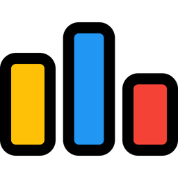

<h1 align="center">Hi 👋, I'm Devvrat Singh </h1>

## 📖 About Me

-   🖥 Software developer passionate about DSA and Dev
-   🎓 Studying BE Computer Science AI - ML 𝚊𝚝 Adani University graduating October 2025

## ⬆ What I'm up to

-   🔨 I'm currently 

```yaml
- Learning DSA
- Learning AI and ML
- Getting Better at React
```


## 🎒 My Skills

### Languages


### Technologies


<!-- 
### Full Stack Projects
[](https://janmejay.me)
[](https://locally-yours.netlify.app/)
[](https://github.com/NotTheRightGuy/HackNUThon)
[](https://stock-pi-nottherightguy.vercel.app/)
-->

## 🔔 My Github Metrics
<p></p>

<p>&nbsp;</p>

<p></p>
<!--

-->

<!-- 
## 📌 Holopins

[](https://holopin.io/@nottherightguy)
-->

## 📫 How to reach me

You can reach me at the email in my github profile. Some other places you can find me:

[](https://www.linkedin.com/in/devvrat-singh-rathod-a096a9221/)
[](https://twitter.com/Devvrat1010)
[](https://leetcode.com/Devvrat12/)
[](https://codeforces.com/profile/Devvrat1010)
[](https://www.codechef.com/users/devvrat_singh2)


